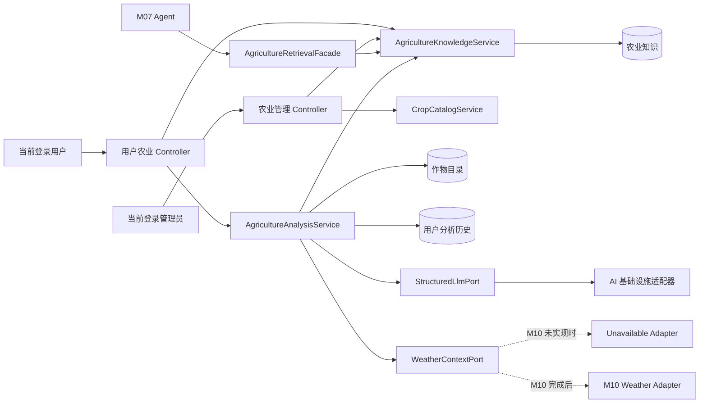

## 2026-08-20 20:14

# M08 农业分析与农业知识完善方案

## 1. 需求回顾

M08 的旧实现包含三项能力：作物别名归一、调用 Kimi 生成作物分析、从农业知识和历史分析中检索文本。现有 NestJS V2 尚未实现 M08，只完成了用户、管理员、认证和角色鉴权基础。

旧实现存在以下核心问题：

- 分析使用固定的长安区环境、模拟天气和模拟市场数据，结果看似实时但数据不真实。
- 生成分析使用 GET 请求并写数据库，违反 HTTP 语义，也难以做幂等和费用控制。
- 模型返回内容作为 JSON 字符串直接存储，没有结构校验、字段版本和失败降级。
- `crop_analysis` 按“作物 + 地区”覆盖，无法形成属于当前用户的真实历史。
- 历史查询没有从 Token 取得用户身份，也没有用户隔离。
- 农业知识只有简单模糊查询，没有维护、审核、发布、失效和来源追踪流程。
- 作物别名硬编码，新增作物必须修改代码。
- M07 可混合检索公共知识和全部历史分析，缺少清晰的数据边界。
- 旧路径 `argiculture` 拼写错误，且分析生成和查询接口表达能力不足。

本方案的目标是把 M08 建成一个可以脱离 M07 独立运行、可以在 M10 未完成时诚实降级、可以持续维护知识内容、可以追溯每次模型结果的领域模块。

## 2. 范围与优先级

### 2.1 P0：本轮必须完成

1. 作物目录与别名归一，可由管理员维护并提供用户侧查询。
2. 农业知识后台 CRUD、审核发布、归档和用户侧检索。
3. 用户创建结构化农业分析，分析身份只取当前 Access Token。
4. 用户查询自己的分析列表和详情，禁止跨用户访问。
5. 模型输出通过 Zod 校验后再保存为 PostgreSQL `jsonb`。
6. 保存输入、外部上下文、引用知识、模型和 Prompt 版本，确保结果可追溯。
7. M10 尚不可用时不使用模拟天气；显式返回“实时天气未接入”的数据质量提示。
8. 为 M07 暴露内部只读检索能力，默认只检索已发布公共知识，不检索其他用户分析。
9. 提供数据库迁移、种子数据、单元测试、仓储集成测试和鉴权 E2E 测试。

### 2.2 P1：P0 稳定后增强

1. 接入 M10 实时天气上下文。
2. 知识版本历史、分析反馈与管理员聚合统计。
3. 合法、稳定的数据源明确后接入市场行情；在此之前不展示模拟行情。
4. 旧 MySQL 数据一次性导入和旧路径兼容适配器。
5. 当知识规模或检索评测证明有必要时，再引入向量检索。

### 2.3 本轮不做

- 不在 M08 内实现 M07 Agent、SSE 对话或多轮会话。
- 不在 M08 内重复实现 M10 的天气 API 调用。
- 不引入 Redis、BullMQ、微服务、CQRS 或 pgvector。
- 不构造看似真实的天气、价格、病虫害监测数据。
- 不提供模型自动发布知识的能力；知识发布必须由管理员确认。

## 3. 技术方案概述

沿用现有 NestJS 11、TypeScript 6、PostgreSQL 18、MikroORM 7、class-validator 和 Zod 技术栈。HTTP 请求 DTO 使用 class-validator；模型输入输出和 Tool Schema 使用 Zod。

业务层不直接依赖 LangChain 或具体模型 SDK。M08 通过端口调用“结构化模型生成”和“天气上下文”能力，基础设施层提供适配器。这样 M08 可以使用 Fake 适配器完成全部自动化测试，也不会因为 LLM 配置为空而导致知识查询和应用启动失败。



## 4. 技术选型

| 类别 | 选择 | 理由 |
| --- | --- | --- |
| Web 框架 | NestJS 11 | 与当前工程一致，复用 Guard、Filter、Interceptor 和 Swagger |
| ORM | MikroORM 7 | 与现有 Entity、Repository 和 Migration 流程一致 |
| 数据库 | PostgreSQL 18 | 使用外键、部分索引、数组和 `jsonb` 保存结构化快照 |
| HTTP 校验 | class-validator | 延续当前 Controller DTO 约定 |
| AI Schema | Zod | 与项目明确的 AI Schema 边界一致，可做运行时结构校验 |
| AI 调用 | 端口 + OpenAI 兼容适配器 | 隔离 Kimi/其他 Provider，便于 Fake、超时、重试和切换模型 |
| 知识检索 | 精确过滤 + PostgreSQL `pg_trgm` 可选增强 | 先解决中文关键词、作物、分类和标签检索；不提前引入向量数据库 |
| 任务执行 | P0 同步调用 + 持久化状态 + 超时 | 当前没有队列基础设施；先保持部署简单，并为以后异步化保留状态模型 |

`pg_trgm` 应由受审查的 Migration 显式启用。如果目标数据库没有创建扩展的权限，则回退到作物、分类、标签过滤和 `ILIKE`，应用不得因此无法启动。

## 5. 模块划分与目录建议

```text
src/modules/agriculture/
├── agriculture.module.ts
├── controllers/
│   ├── agriculture-analysis.controller.ts
│   ├── agriculture-knowledge.controller.ts
│   ├── admin-agriculture-knowledge.controller.ts
│   └── admin-crop-catalog.controller.ts
├── dto/
├── entities/
│   ├── crop.entity.ts
│   ├── crop-alias.entity.ts
│   ├── agriculture-knowledge.entity.ts
│   ├── agriculture-knowledge-crop.entity.ts
│   ├── crop-analysis.entity.ts
│   └── crop-analysis-knowledge-ref.entity.ts
├── presenters/
├── schemas/
│   └── crop-analysis-result.schema.ts
├── ports/
│   ├── structured-llm.port.ts
│   └── weather-context.port.ts
├── services/
│   ├── crop-catalog.service.ts
│   ├── agriculture-knowledge.service.ts
│   ├── agriculture-analysis.service.ts
│   ├── agriculture-retrieval.facade.ts
│   └── crop-analysis-prompt.builder.ts
└── agriculture.tokens.ts

src/infrastructure/ai/
├── ai-infrastructure.module.ts
└── openai-compatible-structured-llm.adapter.ts
```

| 组件 | 单一职责 | 依赖 |
| --- | --- | --- |
| `CropCatalogService` | 作物和别名解析、后台维护 | Crop Repository |
| `AgricultureKnowledgeService` | 知识 CRUD、状态流转、发布内容检索 | Knowledge Repository、当前管理员 |
| `AgricultureAnalysisService` | 组织输入、上下文、知识和模型调用，持久化历史 | 当前用户、Crop、Knowledge、LLM、Weather |
| `AgricultureRetrievalFacade` | 为 M07 提供只读、限量、可引用的领域检索结果 | Knowledge Service |
| `StructuredLlmPort` | 生成符合 Zod Schema 的模型结果 | AI 基础设施适配器 |
| `WeatherContextPort` | 按地区和时间取得天气上下文或明确不可用 | P0 Null Adapter；P1 M10 Adapter |
| Prompt Builder | 构造确定性 Prompt，隔离不可信知识文本 | 纯函数 |

## 6. 核心业务规则

### 6.1 作物目录

- 作物使用稳定 `code` 和规范中文名，不再把硬编码 Map 当作唯一数据源。
- 别名保存标准化值：去首尾空白、Unicode 规范化、英文转小写、连续空白压缩。
- 同一个标准化别名全局唯一，避免“麦子”同时映射到两个作物。
- 提供迁移种子，覆盖旧实现已有作物和别名。
- 作物被引用后只允许停用，不物理删除。

### 6.2 农业知识生命周期

状态：`draft -> published -> archived`。

- 草稿仅管理员可见。
- 发布必须具备标题、正文、分类、来源名称、适用作物或明确的“通用知识”标记。
- 用户和 Agent 只能检索 `published`、未软删除、未超过 `validUntil` 的内容。
- 修改已发布内容时递增版本号并更新内容哈希；P1 保存完整版本快照。
- 发布和归档记录操作者管理员 ID、时间和版本。
- 知识内容作为不可信外部文本传给模型，使用明确分隔，不允许其中的指令改变系统 Prompt 或工具行为。

### 6.3 农业分析

- `userId` 只取 `@CurrentUser()`，请求体和路径不接受用户 ID。
- 每次生成创建一条新历史，不覆盖同作物同地区旧记录。
- 分析前解析作物、校验地区和输入，检索最多指定数量的已发布知识。
- 天气不可用时继续生成，但 `contextWarnings` 必须包含缺失说明，结果不得声称使用了实时天气。
- 市场行情没有可靠来源时完全省略，禁止使用固定或随机值伪装实时数据。
- 模型调用设置可配置超时；只对明确可重试的网络错误做最多一次短退避重试。
- 模型响应必须通过 Zod。去 Markdown code fence 后仍无法解析或校验时，记录失败状态并返回明确的上游错误。
- 日志只记录分析 ID、用户 ID、耗时、模型、状态和错误码，不记录完整输入、Prompt、Token 或模型正文。
- P0 采用数据库计数实现可配置的每用户每日成功/进行中分析限额，防止模型费用被滥用。

### 6.4 M07 检索边界

- 默认只返回公共已发布知识及引用信息，不返回任何用户历史分析。
- 如果以后允许 Agent 使用个人历史，M07 必须显式传入当前认证用户 ID，M08 再按所有权过滤。
- 不提供“搜索全部用户分析”的服务方法。
- 返回结构化检索结果，不先拼成不可解析的大段文本。

## 7. 分析结果 Schema

模型结果建议采用以下版本化结构，最终以 `jsonb` 保存并由 Presenter 返回对象，而不是字符串：

```ts
interface CropAnalysisResultV1 {
  schemaVersion: '1.0';
  overview: string;
  suitability: {
    level: 'low' | 'medium' | 'high';
    score: number; // 0-100
    reasons: string[];
  };
  risks: Array<{
    type: 'weather' | 'pest' | 'disease' | 'soil' | 'water' | 'other';
    level: 'low' | 'medium' | 'high';
    description: string;
    evidence: string[];
  }>;
  actions: Array<{
    priority: 'low' | 'medium' | 'high';
    action: string;
    timing: string;
    rationale: string;
  }>;
  knowledgeReferences: Array<{
    knowledgeId: number;
    version: number;
    title: string;
  }>;
  contextWarnings: string[];
  disclaimer: string;
}
```

约束：`score` 限制在 0-100；数组设置合理最大长度；字符串设置最大长度；农药剂量、禁限用药和安全间隔期等高风险建议必须引用已发布知识，否则只允许给出“咨询当地农技人员/查看标签”的保守提示。

## 8. 数据模型

### 8.1 `agriculture_crops`

| 字段 | 类型 | 约束或用途 |
| --- | --- | --- |
| `id` | integer | 主键，自增 |
| `code` | varchar(64) | 唯一、稳定业务编码 |
| `name` | varchar(100) | 规范中文名 |
| `scientific_name` | varchar(150), nullable | 可选学名 |
| `status` | varchar(16) | `active` / `inactive` |
| `created_at` / `updated_at` | timestamptz | 审计时间 |

索引：`unique(code)`、规范化 `name` 唯一或大小写不敏感唯一索引。

### 8.2 `agriculture_crop_aliases`

| 字段 | 类型 | 约束或用途 |
| --- | --- | --- |
| `id` | integer | 主键 |
| `crop_id` | integer | 外键，删除限制 |
| `alias` | varchar(100) | 原始显示值 |
| `normalized_alias` | varchar(100) | 全局唯一，用于解析 |

索引：`unique(normalized_alias)`、`index(crop_id)`。

### 8.3 `agriculture_knowledge`

| 字段 | 类型 | 约束或用途 |
| --- | --- | --- |
| `id` | integer | 主键 |
| `title` | varchar(255) | 标题 |
| `summary` | varchar(500), nullable | 列表摘要 |
| `content` | text | 正文 |
| `category` | varchar(32) | 种植、病虫害、土肥、气象风险、采收储存、市场等 |
| `tags` | text[] | 标签，默认空数组 |
| `region_codes` | text[] | 适用行政区，空数组表示通用 |
| `source_name` | varchar(255) | 来源名称，发布必填 |
| `source_url` | varchar(1000), nullable | 来源链接 |
| `source_published_at` | date, nullable | 来源发布时间 |
| `valid_until` | date, nullable | 有效期 |
| `status` | varchar(16) | `draft` / `published` / `archived` |
| `version` | integer | 从 1 开始递增 |
| `content_hash` | varchar(64) | 内容完整性和去重 |
| `created_by` / `updated_by` / `published_by` | integer | 管理员外键 |
| `published_at` | timestamptz, nullable | 发布时间 |
| `created_at` / `updated_at` / `deleted_at` | timestamptz | 审计与软删除 |

索引：状态与发布时间、分类、有效期、标签 GIN；启用 `pg_trgm` 时对标题和正文建立 trigram GIN 索引。

### 8.4 `agriculture_knowledge_crops`

知识与作物的多对多关联。联合主键 `(knowledge_id, crop_id)`，两个字段均有外键；没有关联作物且知识标记为通用时才能发布。

### 8.5 `crop_analyses`

| 字段 | 类型 | 约束或用途 |
| --- | --- | --- |
| `id` | bigint | 主键 |
| `user_id` | integer | 用户外键，禁止请求体覆盖 |
| `crop_id` | integer | 作物外键 |
| `crop_name_snapshot` | varchar(100) | 历史显示快照 |
| `region_code` / `region_name` | varchar | 分析地区快照 |
| `status` | varchar(16) | `processing` / `succeeded` / `failed` |
| `input_snapshot` | jsonb | 生育期、土壤、灌溉、观察等已校验输入 |
| `context_snapshot` | jsonb | 天气可用性、数据时间、来源等，不保存伪造值 |
| `result` | jsonb, nullable | 通过 Schema 的结构化结果 |
| `schema_version` | varchar(16) | 结果 Schema 版本 |
| `prompt_version` | varchar(32) | Prompt 版本 |
| `model_provider` / `model_name` | varchar | 模型追踪信息 |
| `duration_ms` | integer, nullable | 调用耗时 |
| `token_usage` | jsonb, nullable | 若 Provider 返回则保存 |
| `error_code` / `error_message` | varchar, nullable | 对内排查，Presenter 不暴露敏感详情 |
| `created_at` / `completed_at` | timestamptz | 时间 |

索引：

- `(user_id, created_at desc)`
- `(user_id, crop_id, region_code, created_at desc)`
- `(status, created_at)` 用于识别超时未完成记录

不再保留旧表的 `(crop_name, region)` 唯一约束。

### 8.6 `crop_analysis_knowledge_refs`

保存分析引用的知识 ID、知识版本、标题快照和检索相关度。联合唯一 `(analysis_id, knowledge_id, knowledge_version)`，确保结果中的引用可核验。

## 9. 接口设计

所有普通响应继续由全局 Interceptor 包装为 `{ code, message, data }`。

### 9.1 用户端

#### 查询作物目录

```http
GET /api/v2/agriculture/crops?keyword=麦子&page=1&pageSize=20
Authorization: Bearer <user-access-token>
```

返回规范作物和匹配别名。只返回启用作物。

#### 查询农业知识

```http
GET /api/v2/agriculture/knowledge?keyword=锈病&cropId=1&category=pest&page=1&pageSize=20
Authorization: Bearer <user-access-token>
```

只返回已发布且有效的内容。支持 `keyword`、`cropId`、`category`、`tag` 和地区过滤。

#### 农业知识详情

```http
GET /api/v2/agriculture/knowledge/:id
Authorization: Bearer <user-access-token>
```

不存在、未发布、已归档或已过期统一返回 404，避免泄露后台内容状态。

#### 创建农业分析

```http
POST /api/v2/agriculture/analyses
Authorization: Bearer <user-access-token>
Content-Type: application/json

{
  "cropId": 1,
  "regionCode": "610116",
  "regionName": "陕西省西安市长安区",
  "growthStage": "jointing",
  "observations": ["叶尖轻微发黄"],
  "fieldContext": {
    "soilType": "loess",
    "irrigationAvailable": true
  }
}
```

- 成功：HTTP 201，返回完整结构化分析。
- LLM 未配置：HTTP 503；知识查询仍正常。
- LLM 超时或上游错误：HTTP 502/504，并保存失败记录。
- 超过用户每日限额：HTTP 429。
- 请求不包含 `userId`，所有权来自 Token。

#### 查询自己的分析列表

```http
GET /api/v2/agriculture/analyses?cropId=1&regionCode=610116&status=succeeded&page=1&pageSize=20
Authorization: Bearer <user-access-token>
```

#### 查询自己的分析详情

```http
GET /api/v2/agriculture/analyses/:id
Authorization: Bearer <user-access-token>
```

仓储查询条件必须同时包含 `id` 和当前 `userId`；不属于当前用户时返回 404。

### 9.2 管理端

```http
GET    /api/v2/admin/agriculture/crops
POST   /api/v2/admin/agriculture/crops
PATCH  /api/v2/admin/agriculture/crops/:id
POST   /api/v2/admin/agriculture/crops/:id/aliases
DELETE /api/v2/admin/agriculture/crops/:id/aliases/:aliasId

GET    /api/v2/admin/agriculture/knowledge
POST   /api/v2/admin/agriculture/knowledge
GET    /api/v2/admin/agriculture/knowledge/:id
PATCH  /api/v2/admin/agriculture/knowledge/:id
POST   /api/v2/admin/agriculture/knowledge/:id/publish
POST   /api/v2/admin/agriculture/knowledge/:id/archive
DELETE /api/v2/admin/agriculture/knowledge/:id
```

- `admin` 与 `super_admin` 可查询、创建、编辑、发布和归档。
- 软删除仅 `super_admin` 可执行。
- P0 不提供管理员读取单个用户完整分析的接口。
- P1 管理统计只返回聚合指标；若以后开放个体分析排障，需要单独的 `super_admin` 权限与审计记录。

### 9.3 M07 内部契约

```ts
interface AgricultureRetrievalQuery {
  query: string;
  cropId?: number;
  regionCode?: string;
  limit: number; // 服务端限制最大值
}

interface AgricultureRetrievalItem {
  knowledgeId: number;
  version: number;
  title: string;
  excerpt: string;
  sourceName: string;
  sourceUrl: string | null;
  score: number;
}
```

M07 调用 `AgricultureRetrievalFacade.search()`，不直接访问 M08 Repository，也不接收拼接后的 SQL 文本结果。

## 10. 鉴权与授权矩阵

| 能力 | 匿名 | User | Admin | Super Admin |
| --- | --- | --- | --- | --- |
| 查询启用作物 | 否 | 是 | 通过管理端接口 | 通过管理端接口 |
| 查询已发布知识 | 否 | 是 | 是 | 是 |
| 创建分析 | 否 | 是，仅本人 | 否 | 否 |
| 查看分析历史 | 否 | 是，仅本人 | 否 | 否 |
| 维护作物与别名 | 否 | 否 | 是 | 是 |
| 新建/编辑/发布/归档知识 | 否 | 否 | 是 | 是 |
| 软删除知识 | 否 | 否 | 否 | 是 |

用户 Controller 类级别使用 `UserAuthGuard`；管理 Controller 使用 `AdminAuthGuard`、`RolesGuard` 和 `@Roles(...)`。任何业务方法都不得信任 DTO 中的身份字段。

## 11. 关键流程

### 11.1 创建分析

1. Guard 解析 Access Token 并加载实时用户状态。
2. Controller 从 `@CurrentUser()` 取得用户，校验 DTO。
3. 检查每日限额和同请求短时间重复。
4. 解析启用作物并创建 `processing` 分析记录。
5. 检索适用的已发布知识，记录知识版本。
6. 调用 `WeatherContextPort`；不可用时生成上下文警告，不填充模拟值。
7. Prompt Builder 构造版本化、确定性的模型输入。
8. `StructuredLlmPort` 调用模型并用 Zod 校验输出。
9. 事务内写入结果、引用和 `succeeded` 状态；失败则更新为 `failed`。
10. Presenter 返回对象形式结果和数据质量提示。

### 11.2 发布知识

1. 管理员创建或编辑草稿。
2. Service 校验来源、适用范围、内容长度和重复内容哈希。
3. 发布操作记录 `publishedBy`、`publishedAt`，递增版本。
4. 之后用户和 M07 才能检索到该内容。
5. 归档后新分析不再引用；已生成分析仍保留标题和版本快照。

## 12. 关键设计决策

| 决策点 | 选择 | 理由 |
| --- | --- | --- |
| 分析历史 | 每次追加，不按作物地区覆盖 | 保留用户历史、上下文和模型版本，可审计可比较 |
| 用户身份 | 只读 Token 当前用户 | 消除伪造 `userId` 和跨用户访问 |
| 天气缺失 | 明确降级，不用模拟值 | 保证结果诚实，M08 可独立完成且不阻塞 M10 |
| 模型输出 | Zod 校验后的 `jsonb` | API 类型稳定，可演进并避免 JSON 字符串二次解析 |
| 知识发布 | 管理员审核状态机 | 防止未经确认的内容进入用户建议和 Agent 上下文 |
| 检索 | 结构化过滤优先，trigram 可选 | 适合当前小规模中文知识，控制复杂度 |
| 向量检索 | 暂不引入 | 当前没有 pgvector，且尚无检索基准证明收益 |
| 模型耦合 | 业务端口隔离 Provider | 支持 Fake、切换模型、超时和故障处理 |
| M07 数据范围 | 默认仅公共知识 | 防止跨用户分析泄露，保持 Tool 的最小数据权限 |
| 旧接口 | 新 V2 为主，兼容层可选且标记弃用 | 修复 GET 写操作和拼写错误，不让历史缺陷污染领域设计 |

## 13. 配置建议

新增配置全部进入现有 Joi 校验和 `configuration.ts`，不在业务代码散落常量：

| 变量 | 默认值建议 | 用途 |
| --- | --- | --- |
| `AGRICULTURE_ANALYSIS_ENABLED` | `true` | 可独立关闭付费分析，不影响知识查询 |
| `AGRICULTURE_ANALYSIS_DAILY_LIMIT` | `10` | 每用户每日分析限额 |
| `LLM_TIMEOUT_MS` | `30000` | 模型超时 |
| `LLM_MAX_RETRIES` | `1` | 明确可重试错误次数 |
| `AGRICULTURE_KNOWLEDGE_LIMIT` | `8` | 单次分析引用知识上限 |
| `AGRICULTURE_LEGACY_ROUTES_ENABLED` | `false` | 是否临时挂载旧 `argiculture` 兼容路由 |

LLM 配置继续允许为空；应用启动、作物目录和知识查询不得依赖真实 LLM Key。

## 14. 旧数据与接口迁移

### 14.1 数据导入

采用一次性、可重复执行的导入脚本，不让 NestJS 运行时连接旧 MySQL：

1. 从旧库导出 `agriculture_knowledge` 和 `crop_analysis` 为 JSON/CSV。
2. 导入前做字段长度、编码、重复哈希和 JSON 格式校验。
3. 知识默认导入为 `draft`，由管理员补齐来源并发布。
4. 旧 `analysis_text` 可解析为新 Schema 时导入为历史结果；不可解析时只保存到受限的 legacy 快照字段，不伪装成 V1 结构化结果。
5. 导入报告包含成功、跳过、失败和原因，重复执行不产生重复数据。

### 14.2 旧接口兼容

默认只提供 `/api/v2/agriculture/**`。如果旧前端尚未切换，可在配置开启时挂载兼容 Controller：

- `GET /api/v1/user/argiculture/info/db/:crop` 可映射为当前用户最近分析查询。
- 旧 `GET /info/:crop` 会产生写操作，不建议长期保留；如必须兼容，只允许一个明确的过渡版本，并在响应和 Swagger 标记 deprecated。
- 兼容层只做 DTO 转换和响应适配，不复制业务逻辑。

## 15. 异常、可观测性与安全

- 400：DTO、作物、状态流转或发布前置条件错误。
- 401/403：身份无效或管理员角色不足。
- 404：资源不存在、用户无所有权、知识未发布或已归档。
- 409：作物编码、别名、重复内容或并发状态冲突。
- 429：用户分析限额。
- 502/504：模型上游失败或超时。
- 503：分析关闭、LLM 未配置或必要能力不可用。

结构化日志字段建议：`requestId`、`analysisId`、`actorType`、`actorId`、`cropId`、`status`、`model`、`durationMs`、`errorCode`。禁止记录 Authorization、Cookie、完整 Prompt、完整模型响应和农业观察原文。

对知识正文和用户观察做长度限制；Prompt 中使用清晰的数据边界和不可执行声明，降低知识内容或用户文本中的 Prompt Injection 风险。模型建议必须带来源和免责声明，不能代替当地农技人员、标签说明或官方预警。

## 16. 测试与验收

### 16.1 单元测试

- 作物别名规范化：中英文大小写、空白、Unicode、未知别名、停用作物。
- 知识状态机：草稿、发布、归档、失效、重复发布和非法回退。
- 所有权过滤：用户只能读自己的分析。
- Prompt Builder：输入边界、知识分隔、缺失天气、字符上限、版本固定。
- Zod Schema：合法输出、缺字段、越界分数、超长数组、code fence、非 JSON。
- 分析服务：成功、LLM 未配置、超时、重试、Malformed Output、知识为空、天气不可用。
- 每日限额和并发冲突。

### 16.2 Repository / PostgreSQL 集成测试

- 外键、唯一别名、状态索引和用户历史查询顺序。
- `jsonb` 写入读取、事务回滚、并发发布和失败状态更新。
- `pg_trgm` 可用和不可用两种配置路径。
- Migration 正向应用和至少一次回滚验证。

### 16.3 HTTP E2E

- 匿名、User、Admin、Super Admin 的完整权限矩阵。
- 请求体伪造 `userId` 被拒绝或被白名单校验剔除。
- 用户 A 无法读取用户 B 的分析，返回 404。
- 管理员不能通过用户分析接口绕过身份类型隔离。
- 统一响应、真实 HTTP 状态码和 Swagger 契约。

### 16.4 质量门槛

- 全模块行覆盖率不低于 80%。
- 作物归一、知识状态流转、所有权判断、Prompt 构造和模型结果解析等纯业务逻辑尽可能接近 100%。
- 覆盖率不能替代有意义的边界、异常和并发断言。
- 自动化测试使用 Fake LLM、Fake Weather 和固定 Fixture；不得宣称测试过真实模型、真实天气或真实市场数据。

## 17. 最小实现计划

每项保持单一职责、可独立执行，并带明确完成条件。

1. **建立 M08 配置项**：完成标准是 Joi 校验、默认值和配置单测通过，LLM 为空时应用仍可启动。
2. **实现作物与别名 Entity**：完成标准是 Migration 包含唯一约束、外键和回滚 SQL。
3. **实现旧作物别名 Seed**：完成标准是可重复执行且重复运行不新增重复行。
4. **实现作物解析纯函数和 Service**：完成标准是别名边界单测通过。
5. **实现作物用户查询接口**：完成标准是只返回启用作物并通过 User Guard E2E。
6. **实现作物管理接口**：完成标准是 Admin/Super Admin 权限和别名冲突 E2E 通过。
7. **实现农业知识 Entity 与关联表**：完成标准是状态、审计、软删除和索引 Migration 通过。
8. **实现知识草稿 CRUD**：完成标准是 DTO、Presenter、分页过滤和角色 E2E 通过。
9. **实现知识发布与归档状态机**：完成标准是来源、适用范围和非法流转测试通过。
10. **实现用户知识检索**：完成标准是只返回已发布有效内容，作物、分类、标签和关键词过滤测试通过。
11. **定义分析输入 DTO 和结果 Zod Schema**：完成标准是合法/非法 Fixture 测试通过。
12. **定义 LLM 与 Weather 端口**：完成标准是业务模块不导入 LangChain 或具体 Provider。
13. **实现 Fake/Unavailable 适配器**：完成标准是无外部 Key 可跑完整单元和 E2E 测试。
14. **实现结构化 LLM 基础设施适配器**：完成标准是超时、一次重试、Schema 校验和脱敏错误映射测试通过。
15. **实现 Prompt Builder**：完成标准是版本固定、缺失上下文提示和 Prompt Injection 分隔测试通过。
16. **实现分析与引用 Entity**：完成标准是 append-only 历史、用户外键、状态和索引 Migration 通过。
17. **实现创建分析用例**：完成标准是成功、失败、天气缺失、限额和事务回滚测试通过。
18. **实现本人分析列表与详情**：完成标准是 A/B 用户隔离 E2E 通过。
19. **实现 M07 检索 Facade**：完成标准是只返回公共知识且不暴露任意用户分析。
20. **实现旧数据导入脚本**：完成标准是幂等、Dry Run、错误报告和非法 JSON Fixture 测试通过。
21. **执行完整质量门禁**：`typecheck`、`build`、`lint`、`format:check`、单元、集成、E2E、覆盖率全部通过。

## 18. 验收标准

P0 完成时必须能够证明：

- 管理员可以维护、发布和归档带来源的农业知识。
- 用户可以检索已发布知识、生成结构化分析并查看自己的历史。
- 用户身份完全来自 Token，跨用户分析访问不可行。
- 任何分析都能追踪输入、知识版本、上下文来源、模型、Prompt 和 Schema 版本。
- M10 未完成时没有模拟天气或市场数据，响应明确披露数据缺失。
- 模型未配置或异常不会影响应用启动、认证、用户管理和知识查询。
- M07 只能通过明确 Facade 获取公共农业知识，不能跨用户搜索分析历史。
- 数据库约束、Migration、Swagger、日志脱敏和测试门槛均有自动化证据。

## 19. 风险与待确认项

以下事项不阻塞 P0，可先采用保守默认值：

1. **旧接口是否需要兼容**：默认关闭兼容路由；确认旧前端未迁移时再临时开启。
2. **知识维护角色**：现有角色只有 `admin`、`super_admin`，P0 两者均可发布；以后如需“编辑/审核分离”再增加权限模型。
3. **地区标准**：P0 保存行政区代码和名称快照，不在 M08 自建完整行政区字典。
4. **市场数据来源**：没有被确认的合法来源前不接入、不模拟。
5. **同步或异步分析**：P0 同步并持久化状态；当实际 P95 延迟或并发量证明需要时再引入队列。
6. **向量检索**：先建立检索 Fixture 和 Top-K 命中率基线；关键词方案达不到验收目标时再评估 pgvector。

方案已设计完成，可使用 `代码实现` 进入下一阶段。

---
