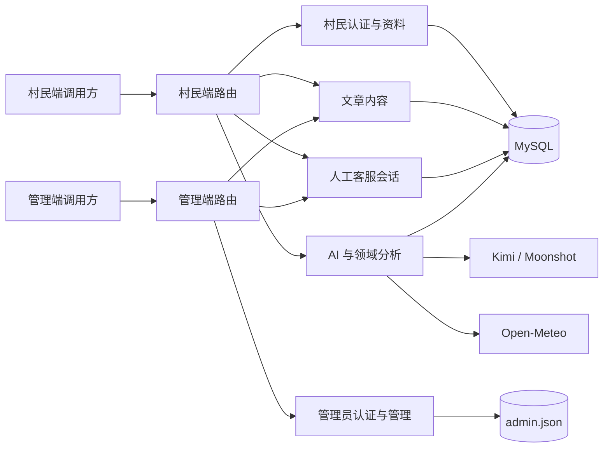

# 原后端业务模块分析

## 1. 分析范围与结论口径

- 分析对象：`servers` 目录中的现有 Express 后端。
- 未分析、未修改 `front-end`。
- `nest_server` 当前没有业务代码，本文件只为后续 NestJS 重构记录现状，不包含重构实现。
- 结论优先级：运行时代码与路由挂载关系 > SQL 建表代码 > `servers/docs` 中的历史文档。
- 当前后端共有 51 个 JavaScript 源文件；现有 `npm run build` 只做语法、相对导入和循环依赖检查，检查结果通过。
- 现状共暴露 38 个 HTTP 接口，其中 2 个使用 SSE 流式响应。完整清单见同目录下的《接口.md》。

## 2. 系统概览

当前服务是单进程 Express 应用，启动时先注册管理端、村民端路由，再初始化 MySQL 表并监听端口。

### 2.1 运行入口

| 项目 | 当前实现 |
| --- | --- |
| 入口 | `servers/src/app.js` |
| 框架 | Express 5，ES Module |
| 默认端口 | `3000`，可由 `PORT` 覆盖 |
| 请求体 | 全局启用 `express.json()` |
| 跨域 | 只允许 `127.0.0.1:8080`、`8081`、`5500` |
| 管理端路由入口 | `servers/src/app/admin.js` |
| 村民端路由入口 | `servers/src/app/user.js` |
| 数据库初始化 | 启动时执行 `servers/src/common/db/init.js` |

### 2.2 存储与外部依赖

| 类型 | 用途 | 当前实现 |
| --- | --- | --- |
| MySQL | 村民、文章、领域分析、知识库、人工客服 | `mysql2/promise` 连接池 |
| JSON 文件 | 管理员账户 | `servers/data/admin/admin.json` |
| 进程内 Map | 旧版 AI 多轮聊天历史 | 进程重启即丢失，不跨实例共享 |
| Kimi / Moonshot | 旧版 AI、农业分析、健康分析、统一 Agent | OpenAI 兼容接口 |
| Open-Meteo | Agent 天气查询 | 地理编码接口与天气预报接口 |
| SQLite 文件 | 历史遗留 | `servers/data/client/village.db` 存在，但当前源码没有引用 |

## 3. 业务模块清单

| 编号 | 业务模块 | 面向对象 | 主要能力 | 对外入口 | 主要数据或依赖 |
| --- | --- | --- | --- | --- | --- |
| M01 | 管理员认证与权限 | 管理员 | 注册、登录、签发 JWT、角色校验 | `/api/v1/admin/auth` | `admin.json`、JWT |
| M02 | 管理员管理 | 已登录管理员 | 列表、修改、删除管理员 | `/api/v1/admin/administrator` | `admin.json` |
| M03 | 村民账户与资料 | 村民、管理员 | 注册登录、Token 校验、资料维护、后台村民管理 | `/api/v1/user/auth`、`/api/v1/user/info`、`/api/v1/admin/villagers` | `users` |
| M04 | 文章内容 | 村民、管理员 | 后台 CRUD、公开列表、Banner、详情与浏览量 | `/api/v1/admin/articles`、`/api/v1/articles` | `article` |
| M05 | 人工客服会话 | 村民、超级管理员 | 单会话创建、消息发送、历史消息、增量轮询、已读状态 | `/api/chat`、`/admin/chat` | `conversations`、`messages` |
| M06 | 旧版通用 AI 聊天 | 村民 | 进程内多轮对话、SSE 流式回答 | `/api/v1/user/aichat` | Kimi、内存 Map |
| M07 | 统一智能 Agent | 村民 | 判断问题类型、调用农业/健康/天气工具、SSE 回答 | `/api/agent` | LangChain、Kimi、M08/M09/M10 |
| M08 | 农业分析与农业知识 | 村民、Agent | 生成作物分析、查询历史分析、检索农业知识 | `/api/v1/user/argiculture`；Agent 内部工具 | `crop_analysis`、`agriculture_knowledge`、Kimi |
| M09 | 健康分析与健康知识 | 村民、Agent | 生成健康分析、查询历史分析、检索健康知识 | `/api/v1/user/healthy`、`/api/v1/user/info/healthy`；Agent 内部工具 | `health_analysis`、`health_knowledge`、Kimi |
| M10 | 天气查询能力 | Agent 内部 | 城市解析、实时天气与三日预报、场景建议 | 无独立 HTTP 接口 | Open-Meteo |

下面的模块说明只描述现状。安全问题、边界混杂或实现不一致会标为「现状风险」，不在本阶段修改。

## 4. 业务模块详解

### M01 管理员认证与权限

**职责**

- 公开注册管理员。
- 使用管理员名称和密码登录。
- 根据角色生成带前缀的管理员编号：`super_admin` 使用 `s`，`common_admin` 使用 `c`。
- 签发有效期 24 小时的管理员 JWT。
- 为受保护路由校验 JWT；人工客服后台额外要求 `super_admin`。

**数据与流程**

`注册请求 -> 读取 admin.json -> 检查 adminname -> 生成 adminID -> 覆盖写回 JSON`

`登录请求 -> 读取 admin.json -> 明文比对密码 -> 签发 JWT`

JWT 载荷只有：

- `id`：从 `adminID` 中提取数字，例如 `s01` 变为 `1`。
- `role`：管理员角色。

**模块边界**

- 管理员信息没有进入 MySQL。
- 注册和登录路由不经过管理员鉴权。
- 除人工客服外，管理员管理、文章管理、村民管理只要求有效管理员 Token，不区分角色。

**现状风险**

- 密码以明文存储和比较。
- JWT 密钥硬编码在源码中。
- 注册接口公开，调用方可以提交 `super_admin`。
- 登录响应返回完整管理员对象，其中包含密码。
- JSON 文件读改写没有并发控制，多进程或并发写入可能互相覆盖。

### M02 管理员管理

**职责**

- 查询全部管理员。
- 删除管理员。
- 修改管理员名称、密码、手机号和角色。

**主要规则**

- 列表直接返回 `admin.json` 全部记录。
- 删除接口使用路径参数 `:id` 匹配 `adminID`。
- 修改接口虽然声明了路径参数 `:id`，实际忽略该参数，使用请求体中的 `adminID` 查找记录。

**现状风险**

- 列表会返回密码字段。
- 修改操作允许直接覆盖密码和角色，没有字段校验。
- 当前登录管理员可以删除或修改任意管理员，包括自身和超级管理员。
- 管理接口没有使用已有的 `requireRole` 角色中间件。

### M03 村民账户与资料

该模块由村民认证、村民自助资料、后台村民管理三部分组成，三部分共同操作 `users` 表。

#### 村民认证

- 注册：写入手机号、密码、姓名、性别、生日、地址。
- 登录：以手机号和密码直接查询用户。
- Token 校验：只要用户 JWT 有效就返回成功。
- 村民 JWT 有效期 24 小时，载荷包括 `id`、`phone`、`name`。

#### 村民自助资料

- 按路径 `:id` 更新完整用户资料。
- 通过请求体中的 `phone` 查询最近一次健康分析。

#### 后台村民管理

- 分页查询全部村民。
- 按用户 ID 删除村民。
- 按用户 ID 更新完整资料。

**现状风险**

- 密码在数据库中明文存储，登录使用明文比对。
- 登录响应返回 `SELECT *` 得到的完整用户对象，其中包含密码。
- 注册没有必填、类型和格式校验；失败时仍返回 HTTP 200。
- 自助资料更新只验证 Token 是否存在，没有校验路径 `:id` 是否等于 `req.user.id`。
- 后台列表使用 `SELECT *`，同样会返回密码。
- 更新语句要求一次提交所有字段；缺失字段会被写成 `undefined` 对应值或触发数据库错误。
- 删除村民时没有清理会话、消息、健康分析等关联数据，数据库也没有外键约束。

### M04 文章内容

**管理端能力**

- 创建文章。
- 修改文章。
- 删除文章。
- 按关键词、分类、状态分页查询。
- 查询任意状态的文章详情。

**村民端能力**

- 查询最多 5 条已发布 Banner 文章。
- 按分类分页查询已发布文章。
- 查询已发布文章详情，并增加浏览量。

**文章字段**

- 基础内容：`title`、`summary`、`content`、`cover`、`category`。
- 展示控制：`isBanner`、`isTop`、`status`。
- 统计与时间：`views`、`createTime`、`updateTime`。

**模块关系**

- 村民端文章服务直接复用管理端的 Repository 和 Validator。
- 列表统一按置顶优先、创建时间倒序排列。

**现状风险**

- `status` 只做 `Number()` 转换，没有限制允许值。
- 公开详情先读取文章，再更新浏览量，因此本次响应中的 `views` 是增加前的值。
- 浏览量读取与更新不是原子返回流程。
- 管理端任何有效管理员角色都可执行文章 CRUD。

### M05 人工客服会话

人工客服是村民与村委会管理员之间的持久化文本会话，与 AI 聊天是不同业务。

#### 村民侧

- 每个用户按设计获取一个会话；不存在时自动创建。
- 获取全部历史消息。
- 发送文本消息。
- 使用 `lastMessageId` 轮询增量消息。
- 将当前会话未读数清零。

#### 管理侧

- 仅 `super_admin` 可访问。
- 查看所有会话和村民名称。
- 查看指定会话历史消息。
- 使用 `lastMessageId` 轮询新消息。
- 发送管理员消息。
- 标记会话已读。

#### 状态更新

- 村民发送消息：新增 `user` 消息，会话未读数加 1，`is_admin_read` 设为 0。
- 管理员发送消息：新增 `admin` 消息，更新最后消息信息，但不增加未读数。
- 管理员标记已读：未读数归零，`is_admin_read` 设为 1。
- 村民标记已读：只将同一个 `unread_count` 字段归零。

**现状风险**

- `conversations.user_id` 没有唯一约束，并发首次访问可能创建多个会话。
- `messages.conversation_id` 和 `conversations.user_id` 没有外键。
- 只有一个 `unread_count`，却同时被村民端和管理端当作未读数使用，无法分别表示双方未读状态。
- `is_admin_read` 只表示管理员侧读取状态，没有对应的村民侧读取状态。
- 管理端路径是 `/admin/chat`，没有使用其他管理接口的 `/api/v1/admin` 前缀。

### M06 旧版通用 AI 聊天

**职责**

- 接收 `userId` 和 `prompt`。
- 按调用方传入的 `userId` 在进程内保存多轮对话。
- 调用 `moonshot-v1-8k`，通过 SSE 逐片返回内容。
- 上下文达到 21 条消息时删除最早两条非系统消息。

**现状定位**

- 这是早于统一 Agent 的旧入口。
- 虽然路由要求村民 JWT，但会话分组依据是请求体 `userId`，没有使用 Token 中的用户 ID。
- 对话只存在于当前 Node.js 进程内，重启、扩容或切换实例后丢失。

**现状风险**

- 调用方可伪造其他 `userId`，读取不到历史响应正文，但会污染或共享对应内存会话。
- 路由没有参数校验和异常处理；上游异常可能中断 SSE。
- 没有持久化、会话过期和内存清理机制。
- 与 M07 功能重叠，后续是否保留属于产品决策，当前代码不能判断。

### M07 统一智能 Agent

**职责**

- 接收单条 `message`。
- 使用 LangChain Agent 和 Kimi `kimi-k2.6` 判断是否调用工具。
- 农业问题调用农业检索，健康问题调用健康检索，天气问题调用实时天气查询。
- 普通问题由模型直接回答。
- 通过 SSE 返回文本片段、完成事件或错误事件。

**调用关系**

`POST /api/agent -> Agent -> agricultureService | healthService | weatherService -> Kimi 生成回答`

**当前边界**

- 路由要求村民 JWT，但业务逻辑不读取 Token 中的用户信息。
- 每次只向 Agent 发送当前一条用户消息，不保存多轮上下文。
- 农业和健康工具可能检索所有历史分析数据，不按当前登录用户隔离。
- `agent/services/agentService.js` 内部重新定义三个工具；`agent/tools` 下另有三份工具定义，但当前 Agent 没有导入它们。

**现状风险**

- 健康工具会按关键词搜索所有用户的健康分析，可能把其他用户的健康信息提供给模型。
- `KIMI_API_KEY` 在模块加载阶段强制校验；缺少该环境变量时整个服务无法启动，即使调用方只需要非 AI 接口。
- SSE 建立后发生错误时仍使用 SSE 错误事件，HTTP 状态通常保持 200。

### M08 农业分析与农业知识

**独立分析能力**

- 规范化作物别名，例如「大米」归一为「水稻」。
- 将固定的长安区农业环境、模拟天气和模拟市场行情发送给 Kimi。
- 要求模型返回农业分析 JSON 文本。
- 按「作物名称 + 地区」新增或覆盖 `crop_analysis`。
- 按作物名称查询最近一次分析。

**Agent 检索能力**

- 从 `agriculture_knowledge` 按标题、内容、标签模糊搜索，最多 5 条。
- 从 `crop_analysis` 按作物、地区或分析正文模糊搜索，最多 5 条。
- 将两类查询结果拼成文本交给 Agent。

**现状风险**

- HTTP 路径中的 `argiculture` 是拼写错误，但它是当前真实路径。
- 独立农业分析中的天气和市场数据是源码固定值，不是 M10 的实时天气。
- 模型返回值未做 JSON 解析和结构校验，接口把它作为字符串返回和存储。
- 历史查询只按作物名称，不按地区过滤；当未来出现多个地区时，结果可能不符合调用方预期。
- `agriculture_knowledge` 没有数据维护接口，当前代码看不出知识数据由谁录入。

### M09 健康分析与健康知识

**独立分析能力**

- 接收基础信息、症状、生活习惯、既往病史。
- 调用 Kimi 生成结构化健康风险、疾病可能性、用药和就医建议。
- 尝试解析模型返回的 JSON，并保存到 `health_analysis`。
- 按 `user_id` 查询最近一次健康分析。

**Agent 检索能力**

- 从 `health_knowledge` 按标题、内容、标签模糊搜索，最多 5 条。
- 从 `health_analysis` 的全部文本字段模糊搜索，最多 5 条。
- 将知识与历史分析拼成文本交给 Agent。

**现状风险**

- 分析接口允许请求体 `userId` 覆盖 Token 手机号；历史查询接口也允许任意路径 `userId`。
- 另一个查询入口使用请求体 `phone` 作为 `user_id`，当前身份键可能是手机号，也可能是其他调用方值。
- `health_analysis.user_id` 没有唯一约束；保存逻辑先查再更新，并发时仍可能产生重复记录。
- 健康 Prompt 的用户输入标签在源码中出现乱码，可能影响模型理解。
- Agent 健康检索不做用户隔离，涉及敏感数据泄露风险。
- `health_knowledge` 没有数据维护接口。

### M10 天气查询能力

**职责**

- 默认查询西安，也可接收其他中国城市。
- 调用 Open-Meteo 地理编码接口解析经纬度。
- 调用 Open-Meteo 天气接口获取当前天气和未来 3 天预报。
- 将天气码转换成中文，并给出出行或农事建议。

**当前边界**

- 只作为统一 Agent 内部工具，没有直接 HTTP 路由。
- 请求超时为 8 秒。
- 外部服务失败时返回一段可读错误文本，不向上抛出异常。

## 5. 数据模型归属

| 表或文件 | 所属模块 | 关键字段 | 当前约束与用途 |
| --- | --- | --- | --- |
| `admin.json` | M01、M02 | `adminID`、`adminname`、`password`、`phone`、`role` | 代码检查名称重复；无数据库约束 |
| `users` | M03、M05 | `id`、`phone`、`password`、资料字段 | `phone` 唯一 |
| `article` | M04 | 内容、展示状态、浏览量 | 按状态、分类、Banner、创建时间建索引 |
| `conversations` | M05 | `user_id`、状态、最后消息、未读状态 | `user_id` 只有普通索引，不唯一 |
| `messages` | M05 | `conversation_id`、发送方、类型、内容 | 没有外键；按会话和时间建索引 |
| `crop_analysis` | M08 | 作物、地区、分析文本 | `crop_name + region` 唯一 |
| `agriculture_knowledge` | M08 | 标题、内容、标签、来源 | 供 Agent 检索，无维护接口 |
| `health_analysis` | M09 | `user_id`、四类输入、分析 JSON | `user_id` 只有普通索引 |
| `health_knowledge` | M09 | 标题、内容、标签、来源 | 供 Agent 检索，无维护接口 |

数据库没有声明任何外键。`users`、`conversations`、`messages` 之间，以及用户与健康分析之间的关联完整性完全依赖应用代码。

## 6. 跨模块依赖与耦合

| 来源模块 | 依赖模块 | 代码中的关系 |
| --- | --- | --- |
| 村民端文章 | 管理端文章 | 直接导入管理端 Repository 和 Validator |
| 村民资料 | 健康分析 | `/api/v1/user/info/healthy` 直接导入 `userHealthy.js` 的查询函数 |
| 统一 Agent | 农业、健康、天气 | Agent 将三个领域服务注册为工具 |
| 人工客服管理端 | 村民账户 | 会话列表左连接 `users` 取得姓名 |
| 所有 MySQL 模块 | 公共数据库层 | 共用一个连接池和手写 SQL |
| 管理端受保护模块 | 管理员 JWT | 路由挂载时统一校验 Token |
| 村民端受保护模块 | 村民 JWT | 路由挂载时统一校验 Token |

## 7. 公共技术能力

这些不是独立业务模块，但 NestJS 重构时需要保留其行为或明确调整。

### 数据库访问

- 公共连接池提供 `query`、`queryOne`、`execute`、`transaction`。
- 所有 SQL 直接写在 Repository 或工具文件中。
- 启动时自动执行九张表的 `CREATE TABLE IF NOT EXISTS`。
- `servers/sql/schema.sql` 与启动建表代码当前基本一致。

### 鉴权

- 管理员与村民使用不同 JWT 密钥，Token 不能互换。
- 两类 Token 都从 `Authorization: Bearer <token>` 读取。
- 两类 Token 都在 24 小时后过期。
- 只有管理端人工客服使用角色授权。

### 响应与异常

- 多数 JSON 接口使用 `{ code, message, data }`。
- 历史《接口设计规范》写有 `success` 字段，但实际代码没有返回该字段。
- 部分 Controller 将业务异常转换为统一 JSON；大量内联路由没有统一异常处理。
- HTTP 状态码使用不一致，例如村民注册和登录的业务失败仍返回 HTTP 200。
- 两个 AI 接口使用 SSE，事件协议略有不同。

## 8. 历史文档与当前代码的差异

| 历史文档描述 | 当前代码事实 |
| --- | --- |
| 村民数据、聊天或知识表使用 SQLite | 当前业务源码统一从 MySQL 连接池查询；SQLite 文件没有被引用 |
| Agent 天气是本地模拟数据 | 当前 Agent 天气工具调用 Open-Meteo |
| 统一响应包含 `success` | 实际响应只包含 `code`、`message`、`data` |
| Agent 农业、健康工具查询 SQLite | 当前查询 MySQL |
| 用户聊天消息事务是 SQLite transaction | 当前使用 MySQL connection transaction |

## 9. 后续重构前需要由产品或项目负责人确认的事项

这些问题无法仅从代码判断，本次分析不替项目作决定：

1. 公开管理员注册是否是预期业务，是否允许自行注册 `super_admin`。
2. M06 旧版 AI 聊天是否继续保留，还是由 M07 统一 Agent 完全替代。
3. 健康分析的业务身份应使用 `users.id`、手机号，还是独立健康档案 ID。
4. 健康历史是否只允许本人查看，管理员或 Agent 是否允许跨用户检索。
5. 人工客服未读数需要表示管理员未读、村民未读，还是只需要管理员未读。
6. 一个村民是否严格只有一个人工客服会话，还是允许按事项创建多个会话。
7. 农业分析是否需要支持多个地区；若支持，查询历史时应如何选择地区。
8. 农业与健康知识库的数据由谁维护，是否需要后台 CRUD、导入或审核流程。
9. `argiculture` 和 `/admin/chat` 等历史路径在重构后是否必须兼容。

这些事项不影响本文件对当前实现的描述，但会直接影响未来 NestJS 模块边界、数据迁移和兼容接口设计。
