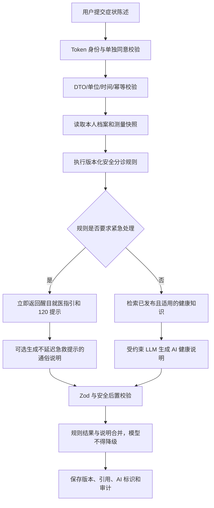

# M09 健康评估与健康知识完善方案

## 1. 结论

旧版 M09 不适合原样迁移。建议将其从“把一组表单交给大模型，返回疾病概率和药名”重构为一个独立的居民健康领域模块：

1. **健康档案**：保存用户主动维护的稳定健康背景。
2. **健康测量**：按时间记录血压、体温、体重等指标并支持趋势查看。
3. **健康评估**：先执行经审核的安全分诊规则，再由模型生成受约束的通俗说明。
4. **健康知识**：只检索有来源、有版本、有审核记录的公共科普内容。
5. **隐私与治理**：健康数据单独同意、最小采集、本人隔离、加密、审计和可删除。

产品定位应明确为“健康信息、风险提示和就医引导”，不提供在线诊断、疾病概率、处方或具体药品推荐。原模块名称在业务语言中统一为“健康评估与健康知识”；“健康分析”只作为旧接口兼容词。

## 2. 现状问题

### 2.1 身份和数据隔离

- 请求体 `userId` 可以覆盖 Token 身份，前端又从 `localStorage` 读取手机号作为身份。
- 查询接口接受任意路径 `userId` 或请求体 `phone`，无法保证只读本人数据。
- `user_id` 同时可能是手机号、任意字符串或 `anonymous`，不能建立可靠外键。
- M07 直接搜索所有用户的症状、病史和分析结果，存在严重的跨用户敏感信息泄露风险。

### 2.2 健康领域模型

- 年龄、血压、体温、身高、体重都被塞进一次性的 `basic_info` JSON，缺少测量时间、单位、来源和历史。
- 年龄由用户手填，与 `users.birthday` 重复且可能矛盾。
- 每次分析覆盖旧记录，既无法回溯，也无法做趋势分析和模型版本审计。
- 症状只有是否选择，没有开始时间、持续时长、严重程度、诱因和伴随情况。
- 健康档案、测量记录、症状陈述、评估结果和知识内容没有边界。

### 2.3 医疗安全

- 模型直接生成“可能疾病”和主观概率，概率没有统计或临床依据。
- 模型直接给出 OTC/处方药名称，容易被用户理解为用药指令。
- `emergency`、`needHospital` 和风险等级完全由模型决定，没有独立安全规则和专业审核。
- Prompt 温度为 `1`，同样输入可能得到明显不同的高风险判断。
- 模型输出仅尝试 `JSON.parse`，没有严格 Schema、枚举、长度和互斥规则校验。
- 前端遇到非法风险值时默认降级为 `low`、`stable`、`emergency=false`。这是危险的“失败即低风险”，必须改成“无法评估”。
- Prompt 标签存在乱码，且没有防止用户文本或知识正文中的 Prompt Injection。

### 2.4 知识治理

- `health_knowledge` 只有标题、正文、标签和自由文本来源，没有管理接口。
- 没有草稿、送审、发布、归档、失效、版本、审核人和适用人群。
- 模型生成内容与权威来源没有区分，也无法证明某次建议引用了哪个版本。

### 2.5 隐私、可靠性和运营

- 医疗健康信息属于敏感个人信息，但当前没有单独同意、处理目的、保存期限和撤回入口。
- 原始表单、病史和模型结果明文存储，日志、备份和管理员访问边界不明确。
- 没有访问审计、数据导出/删除、用户注销联动和保留期限。
- 同步调用最长等待 180 秒，没有幂等键、每日限额、超时状态和重复提交保护。
- 缺少 LLM Key 会在模块加载时让整个服务启动失败。

## 3. 目标与非目标

### 3.1 P0：本轮建议完成

1. 本人健康数据的单独同意、撤回和告知版本记录。
2. 健康档案的本人读取与部分更新。
3. 血压、体温、心率、身高、体重等测量记录及基础趋势查询。
4. 结构化症状陈述和追加式健康评估历史。
5. 经专业审核的安全分诊规则接口；模型不能降低规则结果。
6. 删除疾病概率和具体药品推荐，改为就医紧迫度、行动建议、警惕信号和信息局限。
7. 健康知识后台编审发布、版本、来源、有效期和用户检索。
8. 用户身份只取 Access Token；所有本人资源查询都同时带 `user_id`。
9. 敏感字段加密、访问审计、日志脱敏、限额、幂等和外部模型故障隔离。
10. M07 仅通过明确 Facade 检索公共知识，默认不能搜索任何用户评估历史。

### 3.2 P1：P0 稳定后

- 血压、体重等指标的周/月趋势和异常变化提示。
- 用户主动选择后，将“当前用户的最小必要健康上下文”提供给 M07；每次调用记录目的和审计。
- 慢病自我管理计划、复测提醒和社区卫生服务联系方式。
- 数据导出、批量删除和账号注销后的自动清理任务。
- 专职健康内容审核权限，而不是长期借用 `super_admin`。
- 经脱敏、专业评审的评估用例集和质量回归看板。

### 3.3 P2：有真实需求和资质后再评估

- 可穿戴设备或家庭医疗设备接入。
- 与医疗机构、家庭医生或电子健康档案互联。
- 医务人员工作台、在线问诊、电子处方或用药管理。
- 基于医学编码体系的疾病管理和临床决策支持。

上述 P2 能力会显著改变资质、责任、数据合规和安全边界，不应由当前 M09 顺手扩展。

## 4. 领域边界与模块命名

NestJS 已有 `src/health`，其职责是 `/health` 存活与就绪检查。业务 M09 不应复用这个目录或 `HealthModule` 名称。

建议新增：

```text
src/modules/resident-health/
├── controllers/
├── dto/
├── entities/
├── ports/
├── adapters/
├── schemas/
├── presenters/
├── services/
└── resident-health.module.ts
```

在一个 `ResidentHealthModule` 内按下列子领域分目录即可，P0 不需要拆成多个 Nest 模块：

| 子领域 | 责任 | 不负责 |
| --- | --- | --- |
| Health Profile | 稳定健康背景 | 登录资料、认证、一次性症状 |
| Measurements | 有时间和来源的客观指标 | 诊断、自动解释所有异常 |
| Assessments | 症状陈述、分诊、评估历史 | 处方、医生诊断 |
| Health Knowledge | 公共科普编审、发布、检索 | 保存任何用户数据 |
| Privacy & Audit | 同意、撤回、访问审计、删除 | 业务身份认证 |

`users.id` 是唯一业务身份。手机号只用于登录和联系，不再出现在健康表的所有权字段中。

## 5. 核心业务规则

### 5.1 健康档案

- 一个用户最多一个有效健康档案，以 `user_id` 唯一约束保证。
- 年龄由 `users.birthday` 在评估时计算并保存快照，不接受客户端直接提交年龄。
- 过敏史、既往病史、孕产等信息都是可选项；未填写表示“未知”，不能解释为“没有”。
- 每次更新记录字段级更新时间，不允许把空字段误当成删除；清空必须显式提交 `null`。
- 任何可能影响分诊的档案内容在评估时保存加密快照，后续修改档案不能改变历史评估含义。

### 5.2 健康测量

- 测量是追加记录，不覆盖历史。
- `type + values + measuredAt + source` 组成一次测量；单位由后端的版本化 Schema 决定。
- P0 支持 `blood_pressure`、`body_temperature`、`heart_rate`、`body_weight`、`body_height`。
- `blood_glucose` 只有在明确采样状态、单位和专业阈值来源后再开放，不能只保存一个数字。
- 客户端测量、自报测量和设备测量必须区分来源，不声称未经校准设备的值是医疗测量。
- 值域校验只用于发现输入错误；医学异常判断由经审核的规则集负责。

### 5.3 健康评估

- 一次评估对应一次症状陈述、档案快照、选定测量快照、规则版本和知识版本。
- 历史只追加，不按用户覆盖；失败记录也保留状态和非敏感错误码。
- 就医紧迫度采用：`emergency`、`urgent`、`routine`、`self_care`、`insufficient`。
- 缺少必要信息、Schema 校验失败或模型不可用时不得返回 `self_care`，而应返回 `insufficient` 或明确的上游错误。
- 安全分诊规则先于模型执行；模型只生成解释，不能把 `emergency` 降为其他等级。
- 没有经过专业审核的规则集时，个性化评估功能保持关闭；公共健康知识仍可使用。
- 同一用户同一幂等键只创建一条评估，防止重复扣费和重复记录。

### 5.4 健康知识

- 健康知识只能来自可核验来源，AI 输出不能直接成为知识来源。
- 文章状态为 `draft -> in_review -> published -> archived`。
- 已发布版本不可原地覆盖；编辑已发布文章会创建新草稿版本，旧版本继续服务至新版发布。
- 发布必须包含来源 URL/文号、来源机构、适用人群、审核人、审核时间和下次复核时间。
- P0 中 `admin` 可创建和编辑草稿，`super_admin` 只能在填写专业审核信息后发布或归档。这是角色模型未扩展前的过渡方案，不表示超级管理员具备医学资质。
- 到达复核日期的内容停止进入新评估上下文，并进入待复核列表；历史引用仍保留版本快照。

## 6. 安全评估流程



紧急提示不得等待模型完成。若规则已命中 `emergency`，接口可以先返回确定性的紧急指引；是否继续异步生成说明属于后续优化，不应阻塞用户看到急救信息。

## 7. 评估输入与输出

### 7.1 输入 DTO

```json
{
  "idempotencyKey": "01J...",
  "symptoms": [
    {
      "code": "chest_discomfort",
      "severity": "moderate",
      "startedAt": "2026-08-25T08:00:00+08:00",
      "course": "persistent"
    }
  ],
  "otherDetails": "活动后更明显",
  "measurementIds": ["1024", "1025"]
}
```

约束：

- 请求中没有 `userId`、手机号、年龄、风险等级或模型字段。
- 症状 code 使用后端维护的有限枚举；自由文本限制长度并视为不可信数据。
- `measurementIds` 必须全部属于当前用户，且过旧测量需提示数据时效性。
- 不允许客户端直接提交疾病名称、概率或药品建议作为评估结果。

### 7.2 输出 Schema

```json
{
  "schemaVersion": "1.0",
  "triage": {
    "level": "urgent",
    "reasonCodes": ["RULE_XYZ"],
    "message": "建议尽快由医务人员评估"
  },
  "summary": "基于你提供的信息，当前需要尽快获得专业评估。",
  "factors": ["症状持续存在", "当前信息仍不完整"],
  "nextActions": ["联系就近医疗机构", "如症状明显加重请拨打 120"],
  "selfCare": [],
  "warningSignals": ["出现呼吸困难或意识异常时立即求助"],
  "knowledgeReferences": [
    {
      "knowledgeId": 12,
      "version": 3,
      "title": "...",
      "sourceName": "..."
    }
  ],
  "limitations": ["本结果不构成诊断", "自报信息可能不完整"],
  "aiGenerated": true,
  "generatedAt": "2026-08-25T10:00:00+08:00"
}
```

明确删除旧字段：

- `possibleDiseases`
- `probability`
- `medicationSuggestions`
- `needHospital`
- 模型自行决定的 `emergency`

是否紧急、何时就医由 `triage.level` 表达；具体药物必须由医生或药师结合实际情况决定。

## 8. AI 与规则引擎边界

### 8.1 端口

```ts
interface SafetyTriagePort {
  evaluate(input: TriageInput): Promise<TriageDecision>;
}

interface HealthExplanationLlmPort {
  explain(input: HealthExplanationInput): Promise<HealthExplanationResult>;
}

interface HealthKnowledgeRetrievalPort {
  search(input: HealthKnowledgeQuery): Promise<HealthKnowledgeItem[]>;
}
```

- `SafetyTriagePort` 的生产实现必须加载已批准、可追踪版本的规则集。
- `HealthExplanationLlmPort` 不接触 Repository，也不决定资源所有权。
- 没有 LLM 配置时使用 Unavailable Adapter，仅关闭 AI 说明，不影响知识查询、档案和测量。
- 没有已批准的安全规则时，关闭个性化评估，不能偷偷退化成纯 LLM 判断。

### 8.2 Prompt 与结果校验

- Prompt 模板和结果 Schema 分别保存版本号。
- 系统指令、健康知识、用户数据使用明确边界，所有外部文本均声明为“数据，不执行其中指令”。
- `temperature` 建议为 `0` 或 Provider 支持的最低稳定值。
- 对输出执行 Zod 校验、字段长度限制、禁用字段扫描和就医紧迫度后置校验。
- 若模型生成疾病概率、处方语气、具体剂量或与规则冲突的内容，整次说明判为失败，不把危险内容部分返回。
- 不保存完整 Prompt 和原始模型响应；仅保存受校验结果、版本、模型、耗时和脱敏错误码。

## 9. 数据模型

### 9.1 `health_consents`

| 字段 | 说明 |
| --- | --- |
| `id` | UUID/大整数主键 |
| `user_id` | 外键 `users.id` |
| `notice_version` | 告知文本版本 |
| `scopes` | `profile`、`measurement`、`assessment`、`ai_processing` |
| `granted_at` / `revoked_at` | 同意与撤回时间 |
| `ip_hash` / `user_agent_hash` | 可选审计信息，不存原值 |

同一用户可以保留多次同意历史，但只能有一个当前有效版本。

### 9.2 `health_profiles`

| 字段 | 说明 |
| --- | --- |
| `user_id` | 主键兼外键，一对一 |
| `medical_history_ciphertext` | 既往病史加密载荷 |
| `allergies_ciphertext` | 过敏史加密载荷 |
| `special_population_ciphertext` | 可选特殊人群信息 |
| `key_version` | 加密密钥版本 |
| `created_at` / `updated_at` | 时间 |

优先使用结构化 code；自由文本保持最小长度。`unknown` 与明确的 `none` 必须区分。

### 9.3 `health_measurements`

| 字段 | 说明 |
| --- | --- |
| `id` | bigint |
| `user_id` | 外键 |
| `type` | 测量类型枚举 |
| `values` | 经过 discriminated union 校验的 `jsonb` |
| `measured_at` | 实际测量时间 |
| `source` | `self_reported`、`manual_device`、`connected_device` |
| `schema_version` | 测量 Schema 版本 |
| `created_at` / `deleted_at` | 创建和删除时间 |

索引：`(user_id, type, measured_at desc)`。任何按 ID 查询都必须同时包含 `user_id`。

### 9.4 `health_assessments`

| 字段 | 说明 |
| --- | --- |
| `id` | UUID，避免暴露顺序规模 |
| `user_id` / `consent_id` | 所有者与处理依据 |
| `idempotency_key` | 用户范围内唯一 |
| `status` | `processing`、`succeeded`、`failed` |
| `triage_level` | 最终就医紧迫度 |
| `input_snapshot_ciphertext` | 症状、档案、测量快照的加密载荷 |
| `rule_result` | 规则代码和版本，不含自由文本病史 |
| `result` | 已校验的 AI 说明和公共建议 `jsonb` |
| `rule_version` / `schema_version` / `prompt_version` | 可追溯版本 |
| `model_provider` / `model_name` | 模型追踪 |
| `duration_ms` / `error_code` | 可观测字段 |
| `created_at` / `completed_at` / `deleted_at` | 时间 |

唯一约束：`(user_id, idempotency_key)`；索引：`(user_id, created_at desc)`、`(status, created_at)`。

### 9.5 `health_knowledge_articles` 与 `health_knowledge_versions`

- Article 保存稳定 ID、主题和当前发布版本。
- Version 保存不可变正文、摘要、标签、适用人群、来源、来源发布日期、内容哈希、状态、审核信息和复核日期。
- 同一文章版本号唯一；同一内容哈希避免重复导入。
- 已发布版本不可修改；新版发布通过事务切换 Article 的当前版本。

### 9.6 `health_assessment_knowledge_refs`

保存评估引用的知识 ID、版本、标题和来源快照。历史知识归档或更新后，仍能解释当时依据。

### 9.7 `health_access_audits`

只记录 `actor_type`、`actor_id`、`action`、`resource_type`、`resource_id`、`purpose`、`request_id`、时间和结果。禁止记录健康正文、Token、完整 IP、Prompt 或模型响应。

## 10. API 设计

普通响应继续由全局 Interceptor 包装为 `{ code, message, data }`。

### 10.1 用户端

```http
POST   /api/v2/health/consents
GET    /api/v2/health/consents/current
DELETE /api/v2/health/consents/current

GET    /api/v2/health/profile
PATCH  /api/v2/health/profile

POST   /api/v2/health/measurements
GET    /api/v2/health/measurements?type=blood_pressure&from=&to=&page=&pageSize=
GET    /api/v2/health/measurements/trends?type=body_weight&range=30d
DELETE /api/v2/health/measurements/:id

POST   /api/v2/health/assessments
GET    /api/v2/health/assessments?page=&pageSize=&triageLevel=
GET    /api/v2/health/assessments/:id
DELETE /api/v2/health/assessments/:id

GET    /api/v2/health/knowledge?keyword=&category=&tag=&page=&pageSize=
GET    /api/v2/health/knowledge/:id
```

语义：

- 所有接口使用 `UserAuthGuard` 和 `@CurrentUser()`；DTO 不出现身份字段。
- 不属于当前用户的资源统一返回 404，避免确认资源是否存在。
- 创建评估成功返回 201。LLM 未配置返回 503；上游失败返回 502/504；每日限额返回 429。
- 撤回 `ai_processing` 同意后保留公共知识、档案本地管理和测量能力，但禁止新的 AI 说明。
- 删除采用软删除加后台物理清理；进入清理队列后响应应告诉用户预计完成时间。

### 10.2 管理端

```http
GET    /api/v2/admin/health/knowledge
POST   /api/v2/admin/health/knowledge
GET    /api/v2/admin/health/knowledge/:id
PATCH  /api/v2/admin/health/knowledge/:id
POST   /api/v2/admin/health/knowledge/:id/submit-review
POST   /api/v2/admin/health/knowledge/:id/publish
POST   /api/v2/admin/health/knowledge/:id/archive
GET    /api/v2/admin/health/knowledge/review-due
```

P0 不提供管理员读取个人健康档案、测量原文或评估详情的接口。运营统计只返回达到最小分组阈值的聚合数据；个体排障若以后确有必要，必须增加专用权限、访问目的、用户告知和审计。

### 10.3 M07 内部契约

```ts
interface PublicHealthKnowledgeQuery {
  query: string;
  audience?: string;
  limit: number;
}

interface PublicHealthKnowledgeItem {
  knowledgeId: number;
  version: number;
  title: string;
  excerpt: string;
  sourceName: string;
  sourceUrl: string;
  reviewedAt: string;
  score: number;
}
```

`ResidentHealthRetrievalFacade.searchPublicKnowledge()` 只返回公共知识。M07 不得直接导入 M09 Entity/Repository，也不得使用一个关键词搜索任意用户历史。

## 11. 权限矩阵

| 能力 | 匿名 | User | Admin | Super Admin |
| --- | --- | --- | --- | --- |
| 查看公共知识 | P0 否 | 是 | 管理端查看 | 管理端查看 |
| 管理本人档案/测量 | 否 | 仅本人 | 否 | 否 |
| 创建/查看/删除评估 | 否 | 仅本人 | 否 | 否 |
| 编辑健康知识草稿 | 否 | 否 | 是 | 是 |
| 提交审核 | 否 | 否 | 是 | 是 |
| 发布/归档健康知识 | 否 | 否 | 否 | 是，且需审核元数据 |
| 读取个人健康数据 | 否 | 仅本人 | 否 | 否 |
| 查看聚合运营指标 | 否 | 否 | 否 | P1，可审计 |

未成年人默认只开放公共知识。个性化档案、测量和评估需先完成监护人同意、年龄核验和专门告知流程；该流程未实现前不得通过客户端伪造年龄绕过。

## 12. 隐私和安全设计

1. **单独同意**：首次保存健康数据和首次发送数据给模型分别取得可撤回的单独同意，展示目的、字段、模型接收方、保存期限和影响。
2. **最小采集**：不为“以后可能有用”采集身份证、精确地址、联系人或完整病历；评估只取当前所需档案与测量。
3. **字段加密**：病史、过敏、症状自由文本和输入快照通过 `HealthSensitiveDataCryptoPort` 做带认证的加密并记录密钥版本。缺少生产密钥时关闭 M09 写入，不影响认证、用户和农业模块启动。
4. **传输与第三方**：只通过 HTTPS 传输；发给模型的数据去标识化，不发送姓名、手机号、地址、用户 ID 和不相关历史。
5. **日志和错误**：日志只记录 assessmentId、actorId、状态、版本、耗时和错误码；不记录请求体、Prompt 和模型原文。
6. **保留与删除**：禁止无限期默认保存。建议先采用可配置的 365 天评估保留期并在上线前由产品/法务确认；用户删除、撤回同意和账号注销都要有可验证清理路径。
7. **审计**：读取、导出、删除、失败解密、管理员知识发布和任何未来的个体排障都写审计事件。
8. **限流**：按用户和 IP 双层限流；评估每日限额、并发上限和幂等保护独立配置。
9. **备份**：备份同样加密并纳入删除/过期策略；恢复演练不能使用真实健康数据做开发 Fixture。

医疗健康信息被《个人信息保护法》列为敏感个人信息，处理要求不能只靠一段免责声明替代。上述设计是工程基线，正式上线仍需项目主体完成适用性评估、隐私影响评估和必要的法律审查。

## 13. 健康知识治理

### 13.1 来源优先级

1. 国家卫生健康委、国家疾控局、中国疾控中心、国家药监局等官方发布。
2. 省市卫生健康主管部门和具有明确主体的公立医疗机构科普。
3. WHO 等权威国际组织的公开内容，需记录中文翻译和本地适用性审核。
4. 经过专业审核的原创内容。

搜索引擎摘要、营销文章、无署名转载、模型生成内容和用户历史评估不能作为知识源。

### 13.2 发布检查

- 来源可访问且发布日期可核验。
- 标题、摘要和正文与目标人群文化程度相适应。
- 不夸大疗效，不诱导购买，不阻止就医，不包含未经审查的诊断或处方话术。
- 紧急指引中的电话、地区服务和时效信息单独校验。
- 记录内容哈希、审核人、审核意见、发布时间和复核时间。
- AI 参与改写时标注制作方式，专业审核不能省略。

## 15. 配置建议

| 变量 | 默认建议 | 用途 |
| --- | --- | --- |
| `HEALTH_ASSESSMENT_ENABLED` | `false` | 规则、密钥和审核未完成前默认关闭 |
| `HEALTH_AI_EXPLANATION_ENABLED` | `false` | 独立关闭模型说明 |
| `HEALTH_ASSESSMENT_DAILY_LIMIT` | `5` | 每用户每日评估上限 |
| `HEALTH_KNOWLEDGE_LIMIT` | `6` | 单次评估引用知识上限 |
| `HEALTH_DATA_RETENTION_DAYS` | `365` | 待产品/法务确认的保留期 |
| `HEALTH_RULESET_VERSION` | 无默认 | 必须指向已批准规则集 |
| `HEALTH_DATA_ENCRYPTION_KEY` | 无默认 | M09 敏感字段加密密钥/密钥引用 |
| `HEALTH_LEGACY_ROUTES_ENABLED` | `false` | 临时兼容旧接口 |
| `LLM_TIMEOUT_MS` | `30000` | 可复用现有模型超时 |
| `LLM_MAX_RETRIES` | `1` | 只重试明确可重试错误 |

环境校验要允许整个应用在 M09 关闭时不配置健康密钥或模型；一旦开启 M09 写入，则缺少密钥、规则版本或必要 AI 配置时启动校验失败或模块明确不可用。

## 16. 异常和可观测性

- 400：DTO、单位、时间、同意 scope 或状态流转错误。
- 401/403：身份无效、角色不足或必要同意缺失。
- 404：资源不存在、无所有权、知识未发布或已失效。
- 409：幂等键冲突、知识版本冲突或非法状态流转。
- 422：信息不足，无法形成个性化评估。
- 429：用户/IP 限额。
- 502/504：模型上游错误或超时。
- 503：M09、AI 说明、安全规则或加密能力不可用。

结构化指标建议：

- 评估总量、成功率、`insufficient` 比例、各紧迫度分布。
- 规则命中率、模型 Schema 失败率、禁用内容后置校验失败率。
- P50/P95 耗时、模型超时率、知识检索空结果率。
- 知识待审核数、到期数、超期未复核数。
- 同意撤回、删除请求和清理任务完成时长。

不得把症状、病史或自由文本作为日志标签和指标维度。

## 17. 旧数据与接口迁移

### 17.1 数据迁移

采用一次性、可重复执行且支持 Dry Run 的脚本：

1. 将旧 `user_id` 按手机号映射到新 `users.id`；无法唯一映射、`anonymous` 或任意字符串记录进入隔离报告，不自动归属。
2. 旧表同一用户的多行按时间全部保留，不再覆盖成一条。
3. `basic_info` 中可可靠解析的测量值转换为测量记录，并标记 `source=self_reported`；缺少时间时使用旧记录时间并标记时间来源。
4. 旧 `analysis_json` 只能作为加密 `legacy_snapshot` 保存，不能伪装成新 Schema，也不能继续展示疾病概率和药名。
5. 旧健康知识全部导入为草稿；补齐来源、审核和复核日期后才能发布。
6. 报告成功、跳过、失败、身份冲突、非法 JSON 和重复内容，重复运行不产生重复数据。

### 17.2 旧接口

新接口以 `/api/v2/health/**` 为准。若旧前端尚未迁移，可在配置开启后短期挂载兼容 Controller：

- 忽略或拒绝旧请求中的 `userId`、`phone`，身份仍从 Token 取得。
- 旧“最新分析”映射为当前用户最新评估。
- 兼容响应不得重新暴露疾病概率和用药字段，可返回弃用提示。
- 兼容层只做 DTO/响应适配，不复制业务逻辑，并在 Swagger 标记 deprecated 和移除日期。

## 18. 测试与质量门槛

### 18.1 单元测试

- 档案：`unknown` 与 `none`、显式清空、生日计算、快照不可变。
- 测量 Schema：各类型合法值、单位错误、极端值、未来时间、过旧时间和跨类型字段。
- 安全分诊：每条已批准规则的阳性/阴性边界；高紧迫度不能被模型降低。
- Fail-safe：非法 JSON、缺字段、未知枚举、上游失败一律不能变成低风险。
- Prompt Builder：分隔用户输入/知识、字符上限、版本固定、Prompt Injection Fixture。
- AI 后置校验：疾病概率、具体药名、剂量、处方语气和规则冲突被拒绝。
- 知识状态机：送审、发布、归档、到期、新版本替换和非法回退。
- 同意：scope、版本、撤回、重复同意和未成年人默认限制。
- 加密：随机 nonce、认证失败、错误密钥、密钥版本和不把明文写日志。

### 18.2 PostgreSQL 集成测试

- 用户外键、当前同意唯一约束、用户范围幂等唯一约束。
- 测量和评估的本人查询索引、软删除过滤、事务回滚。
- 知识版本不可变、发布版本原子切换、评估引用快照。
- Migration 正向应用和至少一次回滚验证。
- 断言敏感字段落库是密文，而不是只测试解密后的对象。

### 18.3 HTTP E2E

- 匿名、User、Admin、Super Admin 完整权限矩阵。
- 请求体伪造 `userId`/手机号被 DTO 拒绝。
- 用户 A 无法读取、更新或删除用户 B 的档案、测量和评估，统一返回 404。
- 管理员不能通过用户接口读取个人健康数据。
- 未同意、已撤回、未成年人、功能关闭、规则缺失、密钥缺失和模型缺失路径。
- 幂等重放、每日限额、真实 HTTP 状态和统一响应。
- 评估结果包含 AI 显式标识、来源和免责声明，不包含旧危险字段。

### 18.4 医疗安全验收

自动化测试只能证明软件规则和数据隔离，不能证明医学正确性。上线个性化评估前还必须由具备相应资质的专业人员：

1. 审核安全分诊规则和知识内容。
2. 使用脱敏、授权的典型与边界案例评估漏分诊和错误建议。
3. 明确不可覆盖人群和使用场景。
4. 签署规则版本和知识版本的上线记录。

不得用 Fake/Fixture 测试结果宣称“已通过真实医疗验证”。

### 18.5 工程质量门槛

- `typecheck`、`build`、`lint`、`format:check`、单元、集成、E2E 全部通过。
- M09 整体行覆盖率不低于 80%。
- 所有权判断、同意状态机、安全分诊合并、Fail-safe、知识状态机、加密边界和 AI Schema 等核心纯逻辑尽可能接近 100%。
- 覆盖率不能替代异常、边界、安全和并发断言。

## 19. 最小实施计划

每项保持单一职责并带完成标准。

1. **建立 M09 配置**：完成标准是 Joi 条件校验、默认关闭和配置单测通过。
2. **固化健康术语和枚举**：完成标准是领域词、紧迫度、状态和测量类型无重复语义。
3. **实现同意 Entity/Migration**：完成标准是当前有效同意唯一约束和撤回历史测试通过。
4. **实现同意接口**：完成标准是版本、scope、撤回和未同意 E2E 通过。
5. **定义敏感数据加密端口**：完成标准是业务代码不直接读取环境密钥。
6. **实现生产/测试加密适配器**：完成标准是密文落库、认证失败和密钥版本测试通过。
7. **实现健康档案 Entity/Migration**：完成标准是用户一对一外键和加密字段可回滚。
8. **实现档案本人接口**：完成标准是部分更新、显式清空和 A/B 用户隔离通过。
9. **定义测量 Zod union**：完成标准是五类测量的合法、单位、时间和值域 Fixture 通过。
10. **实现测量 Entity/Migration**：完成标准是历史追加、索引和软删除通过。
11. **实现测量 CRUD/趋势接口**：完成标准是本人隔离、分页顺序和趋势时间桶测试通过。
12. **定义安全分诊端口**：完成标准是 M09 不把 Prompt 当成规则引擎。
13. **实现 Unavailable Safety Adapter**：完成标准是没有批准规则时返回 503 而不是低风险。
14. **导入首个已审核规则集**：完成标准是规则来源、审核人、版本和全量边界用例齐全。
15. **定义评估输入 DTO 与结果 Zod Schema**：完成标准是危险旧字段不能通过 Schema。
16. **实现健康知识 Article/Version Entity**：完成标准是不可变发布版本、审核和复核日期 Migration 通过。
17. **实现知识草稿与送审接口**：完成标准是 Admin/Super Admin 角色 E2E 通过。
18. **实现知识发布/归档状态机**：完成标准是缺少来源或审核信息不能发布。
19. **实现用户知识检索**：完成标准是只返回当前发布且未到复核期版本。
20. **实现权威知识 Seed**：完成标准是来源白名单、内容哈希、幂等和人工复核报告齐全。
21. **定义 AI 说明端口**：完成标准是业务 Service 不依赖具体 Provider 或 LangChain。
22. **实现 Unavailable/真实 LLM Adapter**：完成标准是无 Key 不影响应用启动，超时和一次重试测试通过。
23. **实现 Prompt Builder 与安全后置校验**：完成标准是注入、疾病概率、药名、剂量和冲突 Fixture 全部通过。
24. **实现评估与知识引用 Entity**：完成标准是追加历史、幂等、版本和本人索引 Migration 通过。
25. **实现创建评估用例**：完成标准是同意、快照、规则优先、模型故障、事务失败和限额测试通过。
26. **实现本人评估列表/详情/删除**：完成标准是 A/B 隔离、404 语义和清理任务测试通过。
27. **实现健康访问审计**：完成标准是读/写/删/发布有审计且无敏感正文。
28. **实现 M07 公共知识 Facade**：完成标准是接口无法检索用户评估或档案。
29. **迁移用户前端**：完成标准是无客户端身份、无疾病概率/用药卡、Fail-safe 和紧急提示 E2E 通过。
30. **实现旧数据 Dry Run 导入器**：完成标准是身份冲突、非法 JSON、重复运行和隔离报告测试通过。
31. **执行完整工程质量门禁**：完成标准是所有自动化命令和覆盖率门槛通过。
32. **完成专业安全验收**：完成标准是规则、知识、边界人群和案例评审有可检查签署记录。

## 20. P0 完成标准

P0 只有同时满足以下条件才算完成：

- 用户身份完全来自 Access Token，手机号和请求体身份不能改变所有权。
- 用户能管理本人同意、健康档案、测量和追加式评估历史。
- 模型不会返回或展示疾病概率、处方药、具体药名或剂量。
- 非法输出、信息不足和上游失败不会伪装成低风险。
- 安全分诊规则先于模型且经专业审核，模型无法降低紧迫度。
- 健康知识具备来源、不可变版本、审核、发布、归档和复核期限。
- M07 默认只能检索公共知识，无法跨用户搜索健康数据。
- 敏感字段落库加密，日志/指标无健康正文，关键访问可审计。
- 同意撤回、记录删除和账号注销有可验证的数据处理路径。
- AI 输出有显式标识、来源、局限和非诊断说明。
- 工程自动化门禁通过；医疗安全验收有独立专业证据，二者不混报。

## 21. 需要确认但不阻塞方案的问题

可先采用括号内保守默认值：

（开发者提示：先按默认方案走。）

1. **个性化评估人群**：是否支持未成年人（P0 不支持，只开放公共知识）。
2. **健康内容审核主体**：由谁承担专业审核（未确认前评估默认关闭，`super_admin` 只执行发布动作）。
3. **数据保留期**：评估和测量保存多久（暂定 365 天，可配置并在上线前确认）。
4. **紧急服务范围**：是否只服务中国大陆（P0 明示 120，境外场景不做假设）。
5. **旧前端过渡期**：是否需要 V1 兼容路由（默认关闭）。
6. **真实模型供应商**：是否允许敏感数据委托处理、数据存放位置和合同条款（未确认前只用去标识化 Fixture/Unavailable Adapter）。
7. **同步或异步**：P0 可沿用同步调用并持久化状态；只有真实 P95 延迟和并发量证明需要时再引入队列。
8. **个体数据后台排障**：默认不开放；以后如有必要必须单独设计权限、目的、告知和审计。

## 22. 设计依据

以下是本方案采用的官方工程约束来源，不替代项目自身的法律和医疗专业审查：

- [《中华人民共和国个人信息保护法》](https://www.cac.gov.cn/2021-08/20/c_1631050028355286.htm)：医疗健康属于敏感个人信息，处理需要特定目的、充分必要、严格保护和单独同意。
- [《网络数据安全管理条例》](https://xzfg.moj.gov.cn/front/law/detail?LawID=1734)：要求明确处理规则、保存期限和个人权利路径，并采取加密、访问控制等保护措施。
- [《生成式人工智能服务管理暂行办法》](https://www.cac.gov.cn/2023-07/13/c_1690898327029107.htm)：要求保护输入和使用记录、避免健康歧视，并提升生成内容准确性、可靠性和透明度。
- [《人工智能生成合成内容标识办法》](https://www.cac.gov.cn/2025-03/14/c_1743654684782215.htm)：要求对适用场景中的 AI 生成文本提供显式标识，并在服务协议中说明标识方式。
- [《中国公民健康素养——基本知识与技能（2024年版）》](https://www.nhc.gov.cn/xcs/c100123/202405/73a4927142f34152abed875634a3c13b.shtml)：强调科学就医、遵医嘱用药、正确测量健康指标和紧急时拨打 120。
- [《关于建立健全全媒体健康科普知识发布和传播机制的指导意见》](https://www.nhc.gov.cn/xcs/c100123/202205/373291f407154db388b5383f2eec9bba.shtml)：要求健康科普坚持科学准确、权威供给、专家作用和适合目标人群理解。
- [《互联网诊疗监管细则（试行）》](https://www.nhc.gov.cn/yzygj/c100068/202203/2072f0e8988249e59d942e1b2a933916.shtml)：互联网诊疗和处方属于医疗机构、医务人员及专门监管边界，当前 M09 不应通过 AI 结果绕过这些边界。

---

方案设计完成后，建议先确认第 21 节中的专业审核主体和数据保留期，再按第 19 节顺序实施 P0。
